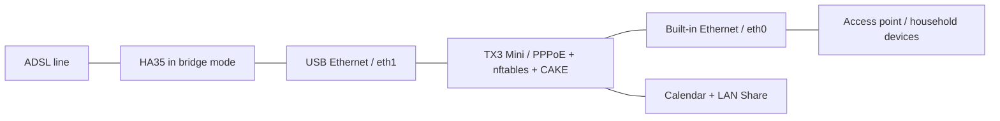

# TX3 Home Router

**Making roughly 10 Mbps down / 500 Kbps up ADSL usable for a household with an old Android TV box.**

The bandwidth was limited, but latency under load was the real problem. With around 15 devices sharing the connection, the project notes describe gaming latency rising from roughly 30 ms at idle to hundreds of milliseconds during congestion, sometimes around 900 ms. An unused TX3 Mini became a Linux router to keep that connection interactive.

The hardware is an Amlogic S905W with four Cortex-A53 cores, about 787 MiB of usable RAM, one built-in 100 Mbps Ethernet port, and a USB ASIX AX88179B adapter. The project grew from basic CAKE queue management into PPPoE, nftables, a behavioral eBPF classifier, and a small home server.

## AI assistance and feedback

AI generated most of the project-specific code and documentation. I brought the needs, tried things on my own setup, and shared the results to guide the work. I'm still learning, and there may be mistakes or better approaches I haven't discovered. Existing projects and libraries are credited separately.

Suggestions, corrections, alternative solutions, and any helpful notes are welcome. Please [open an issue](https://github.com/Ananas0dev/tx3-home-router/issues) or send a pull request—even pointing me toward an existing tool or explaining a better way would help.

## What is here

- [The engineering story](docs/01-the-problem.md): the initial topology, failed approaches, USB driver work, and queue management.
- [eBPF source and build instructions](ebpf/README.md): V5D, its shadow variant, and earlier experiments.
- [USB Ethernet patches](usb-ethernet/README.md): a Linux 6.12 USB-core workaround and a compact ASIX 4.1.0 driver patch.
- [Reported results](benchmarks/README.md): observations and their measurement limits.
- [Operational status](docs/status.md), [recovery](docs/recovery.md), and [roadmap](ROADMAP.md).

## Current status

The [2026-10-02 inspection](docs/live-observation.md) found V4 active, shaping at 450 Kbit/s upload and 10 Mbit/s download. V5D is a separate experiment described in the historical notes; its deployment lifecycle remains unfinished.

The source and configuration examples are specific to this setup and need review before use. See the [status and evidence](docs/status.md), [reported tests](benchmarks/README.md), and [recovery notes](docs/recovery.md).

For the full story, browse the [documentation index](docs/README.md).

Related projects: [Continuous Calendar](https://github.com/Ananas0dev/continuous-calendar), [LAN Share](https://github.com/Ananas0dev/lan-share), and the [homelab index](https://github.com/Ananas0dev/homelab).

See [provenance and licensing](NOTICE.md) before redistributing sources or patches.
