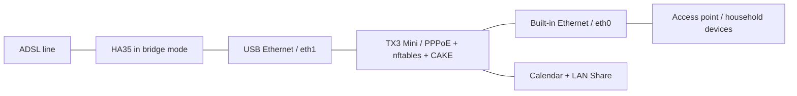

# TX3 Home Router

**Making roughly 10 Mbps down / 500 Kbps up ADSL usable for a household with an old Android TV box.**

The bandwidth was limited, but latency under load was the real problem. With around 15 devices sharing the connection, the project notes describe gaming latency rising from roughly 30 ms at idle to hundreds of milliseconds during congestion, sometimes around 900 ms. An unused TX3 Mini became a Linux router to keep that connection interactive.

The hardware is an Amlogic S905W with four Cortex-A53 cores, about 787 MiB of usable RAM, one built-in 100 Mbps Ethernet port, and a USB ASIX AX88179B adapter. The project grew from basic CAKE queue management into PPPoE, nftables, a behavioral eBPF classifier, and a small home server.

## What is here

- [The engineering story](docs/01-the-problem.md): the initial topology, failed approaches, USB driver work, and queue management.
- [eBPF source and build instructions](ebpf/README.md): V5D, its shadow variant, and earlier experiments.
- [USB Ethernet patches](usb-ethernet/README.md): a Linux 6.12 USB-core workaround and a compact ASIX 4.1.0 driver patch.
- [Reported results](benchmarks/README.md): useful observations with their limits, rather than a fabricated benchmark suite.
- [Operational status](docs/status.md), [recovery](docs/recovery.md), and [roadmap](ROADMAP.md).

## Status and scope

**Live inspection on 2026-10-02 found V4 active at preference 12348, with 450/10000 Kbit/s CAKE.** The [live observation](docs/live-observation.md) supersedes the historical notes for current deployment status. Recovered scripts and service units are included as sanitized references.

This is an engineering record and source archive, not an unattended router installer. The notes contain several generations of the deployment. The later Armbian/PPPoE/V5D account takes precedence over the older ImmortalWrt migration plan. Live settings must be checked separately.

In that later account, V5D was attached at TC preference 12347 in both directions on the LAN interface. REALTIME was mapped to AF41; VOICE was intentionally kept at Best Effort after a failed Voice-tin experiment. The notes explicitly say this arrangement was a **temporary canary**, and that persistent services could restore V4 and older shaping rates after reconnect or reboot.

**430/9800 Kbit/s upload/download was the last subjectively validated setting in the notes. 450/10000 was the next experiment.** These are results for one DSL line, not recommended defaults for another connection.

## Documentation

| Chapter | Subject |
| --- | --- |
| [01](docs/01-the-problem.md) | The latency problem and project goals |
| [02](docs/02-tx3-and-armbian.md) | Hardware, OS, and build environment |
| [03](docs/03-one-legged-router.md) | Why the first topology was insufficient |
| [04](docs/04-wifi-ap-attempt.md) | Wi-Fi and access-point experiments |
| [05](docs/05-usb-ethernet-nightmare.md) | The AX88179B investigation |
| [06](docs/06-ha35-bridge-and-pppoe.md) | Bridge mode, PPPoE, and reconnect behavior |
| [07](docs/07-cake-sqm.md) | CAKE, ATM framing, and rate tuning |
| [08](docs/08-ebpf-qos.md) | Behavioral classification and hysteresis |
| [09](docs/09-home-network-hardening.md) | Deployment boundaries and sanitization |
| [10](docs/10-benchmarks.md) | Evidence and measurement limits |
| [11](docs/11-failures-and-lessons.md) | Failures that changed the design |

Related projects: [Continuous Calendar](https://github.com/Ananas0dev/continuous-calendar), [LAN Share](https://github.com/Ananas0dev/lan-share), and the [homelab index](https://github.com/Ananas0dev/homelab).

See [provenance and licensing](NOTICE.md) before redistributing sources or patches.
