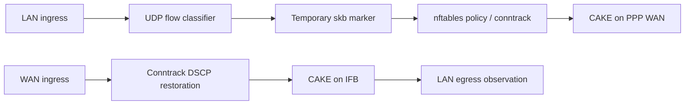

# Behavioral UDP classification

`src/` contains V5D and its observation-only shadow variant. `history/` contains the earlier experiments. The historical entry-point name `classify_udp_v3` remains in V5D; it is not a reliable version identifier.

The real program records IPv4 UDP flows in an 8192-entry LRU hash map. It classifies flow history into UNKNOWN, CANDIDATE, REALTIME, BULK, and VOICE. On upstream packets it sets temporary skb bits `0x40000000` for REALTIME or `0x20000000` for VOICE. It does not assign DSCP itself. The shadow variant records classifications without setting those bits.



## Build on Debian or WSL

Install the build tools with `sudo apt install clang llvm libbpf-dev linux-libc-dev make gcc`, then:

```sh
make -C ebpf
make -C ebpf history
```

Output goes into ignored `ebpf/build/`. The default network is the documentation subnet `192.0.2.0/24`; it is intentionally not a live deployment setting. Set the host-order network and mask for your lab at build time, for example:

```sh
make -C ebpf clean
make -C ebpf LAN_NET=0xC6336400U LAN_MASK=0xFFFFFF00U
```

That example uses `198.51.100.0/24`, another documentation network. A changed variable requires a clean rebuild. The build does not load programs, attach filters, alter nftables, or restart services.

## Deployment limits

These recovered experiments assume ordinary Ethernet carrying IPv4 UDP. They do not handle VLAN headers or IPv6. Fragment handling, concurrent writes to shared map values, flow aging, mark ownership, and cumulative-history behavior require further review. Compilation verifies source/build compatibility, not packet-classification accuracy or the target kernel's verifier.

No automatic attach script is supplied because the notes' V5D lifecycle was unfinished. Loading one object separately for ingress and egress can accidentally create separate maps; both directions must share the intended program/maps. Preserve existing filters and coordinate TC ordering, skb mark consumption, conntrack restoration, and PPP reconnects.

The latest noted policy maps REALTIME to AF41 and VOICE to CS0. Earlier source comments suggesting Voice-tin promotion describe an abandoned experiment.
